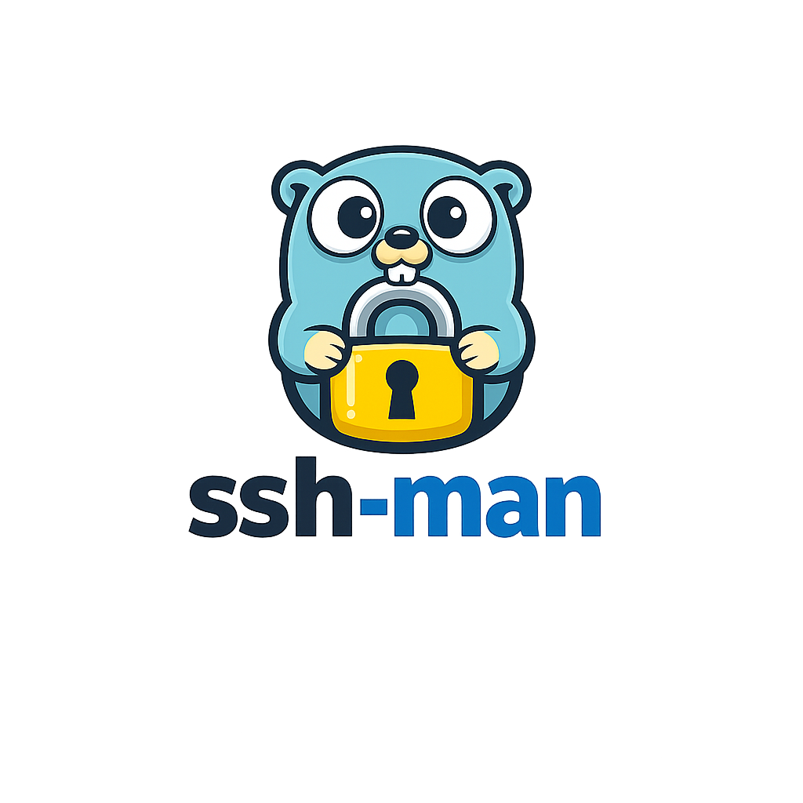

# SSH-MAN



An easy-to-use tui ssh manager, allows for easy viewing and adding of new ssh connections. Written in go and powered by cham's Bubble Tea tui framework. Uses vim like keybinds to keep tui navigation simple and familiar to use.

[](https://woodpecker.andrewpegg.me/repos/1)


## Overview
ssh-man is a lightweight, SSH configuration manager that sits above your existing SSH setup rather than replacing it. Instead of reinventing the SSH layer, ssh-man delegates all connections to the platform-provided OpenSSH binary, ensuring full compatibility with standard SSH workflows, agents, and configs.

At its core, ssh-man uses SQLite as a structured backing store for hosts, keys, and metadata. This enables richer organization and automation than flat config files alone without sacrificing transparency or portability across platforms.

The project focuses on making large and evolving SSH environments manageable. ssh-man tracks useful metadata such as last modification time and last connection, supports tags and free-form notes, and enables fast discovery through fuzzy filtering across hostnames, aliases, and tags.

The terminal UI is intentionally minimal in appearance but powerful in capability. It supports inline editing with WYSIWYG-style previews, guided host creation, SSH key generation, and key rotation workflows through interactive wizards. Automation features make it easy to generate new keys, rotate credentials safely, and keep configurations consistent over time.

In short, ssh-man provides structure, automation, and visibility—while staying lean, transparent, and fully compatible with the SSH tools you already trust.


## Features

🚀 Host Management, Simplified

* Add, edit, delete, and connect to hosts
* Works both in the TUI and via quick CLI commands
* Fuzzy search across hostnames, aliases, and tags
* Tagging + notes for real organization (not just flat configs)
* Tracks last connection + last modification time
* No more scrolling through a 2,000-line ~/.ssh/config.

🔐 Real SSH. No Reinvention no ad-hoc solutions.

* Uses your system’s OpenSSH binary
* No custom protocol layer
* No credential interception
* Full compatibility with agents, hardware tokens, and existing workflows

🔑 Key Generation & Rotation (Without the Pain)

Guided SSH key generation (RSA / ECDSA / ED25519 configurable)
* Interactive key rotation wizard
* Automatic upload of rotated keys to remote hosts
    * Automatic uploads and rotations keep you in the loop to make sure your on board every step of the way
* Configurable key storage paths
* Optional public key cleanup after rotation
* Make credential rotations feal easier than ever before

🖥 Powerful, Minimal TUI

* Vim-style keybindings
* Inline editing of hosts
* Live WYSIWYG preview of the generated SSH config
* Autocomplete for common SSH options
* Dynamic layout that adapts to any terminal size
* Structured wizards for safe edits and host creation

🔄 Sync & Config Control
* Import existing ~/.ssh/config
* Structured conflict resolution policies
* Regenerate SSH config from SQLite storage at any time
* Optional write-through mode for immediate updates


📡 Connectivity & Validation
* Ping hosts to check availability
    * reports 🔴 for host unreachable
    * reports 🟡 for host reachable but connection refused (likely ssh isn't responding)
    * reports 🟢 ssh is reachable 
* Validate configs before using them
* Inspect both SQL and rendered SSH representations

⚙️ Maintenance & Lifecycle
* Automatic update checks
* Optional auto-install on Unix systems
* Clean uninstall support
* Cross-platform: Linux, macOS, Windows

## Security

ssh-man does not copy, export, or archive private SSH keys. Existing keys are referenced by path and used only by the underlying OpenSSH binary at connection time. When keys are generated or rotated through ssh-man, they are written directly to disk using standard SSH tooling and appropriate filesystem permissions. \
All SSH connections are executed through the system-provided OpenSSH client. ssh-man does not intercept authentication flows, handle plaintext secrets, or implement a custom SSH protocol layer. This ensures that agent forwarding, hardware tokens, and existing security controls behave exactly as they would outside the tool. \
Configuration data stored in SQLite is limited to non-sensitive metadata such as host definitions, tags, notes, timestamps, and key references as they would appear in standard ssh config files.

## Parameters
Here is a list of flags that ssh-man expects and their detailed usage 

| Flag                                   | Usage                                                                                                                           |
|----------------------------------------|---------------------------------------------------------------------------------------------------------------------------------|
| --help                                 | gives information about flags in a structured format                                                                            |
| --init                                 | creates necessary project structure in order to run the project                                                                 |
| --uninstall                            | deletes app owned data                                                                                                          |
| --log <debug \| info \| warn \| error> | sets logging level to the provided level                                                                                        |
| --logFile=<0 \| 1 \| False \| True>    | option to turn on or off logging to stdin or file, default is True (logs to file instead of stdin)                              |
| --qa                                   | quick add takes provided host, hostname, and options to enter them into the database in a non interactive way                   |
| --qe                                   | quick edit uses provided host to edit, using values from hostname and options to change the stored object in the SQL table      |
| --qd                                   | quick delete deletes the provided  host from the sql storage table                                                              |
| --qc                                   | quick connect, connects to the host provided by using sql provided configuration and calling ssh binary                         |
| --qs                                   | quick sync, syncs database to the provided file, deals with conflicts using configured option in ssh-man config                 |
| --gh                                   | prints host definition and option as stored inside the SQL table, outputs both sql representation and ssh config representation |
| --cc                                   | create config forces ssh-man to recreate the ssh config based on the sql storage table                                          |
| --update                               | checks for an update, and prompts for auto installation if on a Unix compatible OS, otherwise links to latest release           |
| --validate                             | check whether config provided is valid                                                                                          |
| --parse-config                         | parse and print config to tty                                                                                                   |
| --version                              | print version information to tty                                                                                                |
| --host <str>                           | expects a string defining the host of interest used in quick commands and gh                                                    |
| --hostname <str>                       | used in quick edit, and add sets the hostname of the provided host                                                              |
| --p                                    | sets the port to connect to when using quick connect                                                                            |
| --i                                    | sets the identity file when using quick connect                                                                                 |
| --f                                    | sets the config file used for quick sync                                                                                        |
| --fs                                   | force syncing to occur with provided config file                                                                                |
| --o <SSH OPTION=VALUE>                 | Option list this is used for setting options during add and edit, and is forwarded to the tui if ran                            |


## SSH Configs

ssh-man stores its generated ssh configs in a predefined location

| Platform | Configuration File Path                            |
|----------|----------------------------------------------------|
| Linux    | `~/.config/ssh_man/ssh/config`                     |
| macOS    | `~/Library/Application Support/ssh_man/ssh/config` |
| Windows  | `%LOCALAPPDATA%\ssh_man\ssh\config`                |

This can be advantages to know if you want to reference this config in your normal ssh config. Assuming you are running an openSSH version >= 7.3p1 you can write inside your `~/.ssh/config` the line at the top of the file `Include ~/.config/ssh_man/ssh/config`. The given path is what is valid for Linux for other platforms refer to the table above.

## Configs
ssh-man does support configuration adjustments through a provided yaml file. 

The location of the yaml file is dependent on the platform you are on, heres a table to help you locate the file.

| Platform | Configuration File Path                             |
|----------|-----------------------------------------------------|
| Linux    | `~/.config/ssh_man/config.yaml`                     |
| macOS    | `~/Library/Application Support/ssh_man/config.yaml` |
| Windows  | `%LOCALAPPDATA%\ssh_man\config.yaml`                |


Below is table highlighting on the options that are tunable and their affect \

| option                         | values                             | effect                                                                                                                                                                                                                          |
|--------------------------------|------------------------------------|---------------------------------------------------------------------------------------------------------------------------------------------------------------------------------------------------------------------------------|
| storage_config.storage_path    | filesystem path                    | changes where the database is loaded and save to                                                                                                                                                                                |
| storage_config.write_through   | TRUE\|FALSE defaults to true       | if enabled changes are flushed to generated config immediately, false buffers changes into an action deems a flush necessary                                                                                                    |
| storage_config.conflict_policy | <ignore,favor_config,always_error> | changes behavior when syncing configs to the datastore. By default always_error is chosen and will prompt an error when a config collides with an exist host. favor_config will replace a host with the config provided version |
| ssh.executable_path            | filesystem path                    | if ssh is not on your path or if you want to use a specific version of ssh you can specify its path here                                                                                                                        |
| ssh.key_path                   | filesystem path                    | specify where to save keys after generating them                                                                                                                                                                                | 
| ssh.acceptable_key_algorithms  | [RSA,ECDSA,ED25519]                | you can disable the ability to generate keys of certain types by replacing them, by default all secure types are allowed                                                                                                        |
| ssh.remove_pub_after_gen       | TRUE\|FALSE                        | removes public keys after rotations                                                                                                                                                                                             |
| enable_ping                    | TRUE\|FALSE                        | enables the ability for ssh-man to dial host to check their availability                                                                                                                                                        |
## Screen Shots and Demos


## Installing
### Pre-built binaries
Grab the latest binaries for your system from the GitHub release.
Or if you are on a unix like system, you can use the provided shell script to auto install 
ssh-man. The script does assume curl exist on the system. \
run 
```bash
wget -qO- https://raw.githubusercontent.com/andrewcomputsci2019/sshman/install.sh | bash
```
or
```bash
curl -fsSL https://raw.githubusercontent.com/andrewcomputsci2019/sshman/install.sh | bash
```
### Build form source
due to the low number of dependencies building from source is quite manageable option.
```bash
# Clone repo
git clone https://github.com/andrewcomputsci2019/sshman.git
cd sshman
# Download deps
go mod download
# Build binary to build dir
go build -o ./build/ssh-man ./cmd/sshman/
# or if you want go to install the binary along side your go install
go install ./cmd/sshman/
```

## Getting Started
After installing run 
```bash
ssh-man --init
# if you want to sync your current ssh config
ssh-man --qs ~/.ssh/config
```
Thats all, and your off to the races
## Key Binds
ssh-man follows vim in its style of key binds and thus should be familiar to those who have used it when navigating windows and menus.
### Main View

| key bind | tooltip                 |
|----------|-------------------------|
| k        | go up                   |
| j        | do down                 |
| ↑        | go up                   |
| ↓        | go down                 |
| e        | edit current host       |
| ctrl+w   | cycle viewport          |
| p        | ping current host       |
| g        | generate key for host   |
| r        | rotate a key for a host | 
| a        | add a host              |
| d        | delete a host           |
| enter    | connect to a host       |
### Wizards

| key bind  | tooltip                                                                               |
|-----------|---------------------------------------------------------------------------------------|
| tab       | go to the next input or focusable target                                              |
| shift+tab | go to previous input or focusable target                                              |
| esc       | depending on state this either exits the wizard or loses focus on current focus input |
| enter     | enter input or confirm action                                                         |
| k         | go to previous input                                                                  |
| j         | go to next input                                                                      |
| ↑         | go up                                                                                 |
| ↓         | go down                                                                               |


### Edit View
pressing `e` while highlighting a host in the main view table will bring you into edit mode, here is where you can make inline changes. 

| key bind  | tooltip             |
|-----------|---------------------|
| k         | go up               |
| j         | go down             | 
| ↑         | go up               |
| ↓         | go down             |
| ctrl+k    | scroll preview up   |
| ctrl+j    | scroll preview down |
| tab       | next input          |
| shift+tab | previous input      | 
| ctrl+s    | save changes        |
| ctrl+a    | add option          |
| ctrl+d    | delete an option    |
| ctrl+w    | cycle views         |
| esc       | exit/cancel changes |

## Key Rotations on Windows

due to the fact Windows does not ship with ssh-copy-id rotating keys likely wont work unless you use git-bash as your terminal emulator; another work around is to use WSL2 as your host environment when interacting with ssh-man. All other functionalities are un-affected by platform differences.

## Uninstalling

uninstalling is easy just run ssh-man --uninstall. ssh-man will prompt for conformation that you want to proceed before uninstalling data and config directories. If you want to manually uninstall thats also extremely easy just delete the config and data directories used by your platform (reference the table below)

|                 | Linux                    | macOS                                   | Windows                   |
|-----------------|--------------------------|-----------------------------------------|---------------------------|
| Config location | `~/.config/ssh_man`      | `~/Library/Application Support/ssh_man` | `%LOCALAPPDATA%\\ssh_man` |
| Data location   | `~/.local/share/ssh_man` | `~/Library/Application Support/ssh_man` | `%LOCALAPPDATA%\\ssh_man` |

## Contributing 
At this point I view ssh-man in a complete state and don't foresee addition features coming. I welcome bug reports and bug fixes but for additional features I recommend forking the Project.
